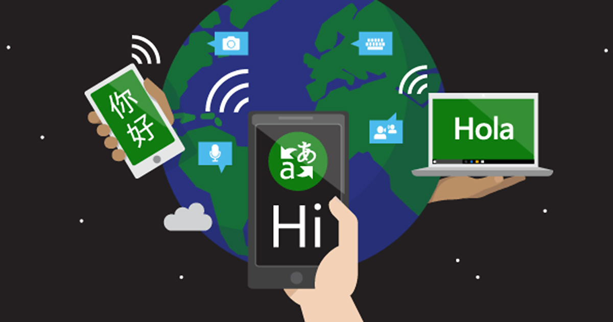

# WHAT'S THAT THING?

#### _C# TEAM WEEK_
#### By _**Ian Scott, Megan HepneKevin Davis**_

### An application that uses two separate AI services to first interpret hosted images on the web for what they are and then provide additional spoken language translation materials.



## **🍎 ABOUT**

This an application that will take most common image files via their host URLs and use Microsoft Azure's Translator API to return the object's possible designations in English based on an AI confidence of 80% or higher. It will then provide the means to translate these returned results into 109 different languages with a Google Translate API.

## **✅ REQUIREMENTS**
* Install [Git v2.62.2+](https://git-scm.com/downloads/)
* Install [.NET version SDK 3.1](https://dotnet.microsoft.com/download/dotnet-core/3.1)
* Install [Visual Studio Code](https://code.visualstudio.com/)
* An Azure subscription - [Create One free!](https://azure.microsoft.com/en-us/free/cognitive-services/)

## **💻 SETUP**

### Microsoft Azure ###
* Once you have your free [Microsoft Azure Account](https://azure.microsoft.com/en-us/free/cognitive-services/) you will need to [create a computer vision resource](https://portal.azure.com/#create/Microsoft.CognitiveServicesComputerVision) to get your API key and endpoint.
* After your Computer Vision Resource is deployed click **Go to Resource.**
* Within the **Resource Managment** subsection within your created resource, select **Keys and Endpoint** to see your resource keys and and endpoint. These will be placed in 'EnvironmentVariables.cs' described below.

### Clone Repository From GitHub ###
* To clone this content, copy the url (https://github.com/Scott-Ian/WhatsThatThing.Solution).
* Open a terminal and navigate to the installation destination of your choosing.
* In the command line use the command ```git clone https://github.com/Scott-Ian/WhatsThatThing.Solution``` to pull down the repo.
* Then navigate inside WhatsThatThing.Solution and enter the command ```code .```

### Update Project With API Key and Endpoint ###
* Create an 'EnviornmentVariables.cs' file in 'WhatsThatThing/Models'.
* Copy the following code into the newly created file:
````
namespace WhatsThatThing.Models
{
  public static class EnvironmentVariables
  {
    public static string ComputerVisionKey  = "[YOUR-API-KEY-HERE!]";
    public static string ComputerVisionEndpoint = "[YOUR-ENDPOINT-HERE]";
  }
}
````
* Replace [YOUR-API-KEY-HERE!] and [YOUR-ENDPOINT-HERE] in the code above with your own API-key and endpoint acquired from your Azure account. 

### Build and Run ###
* Navigate inside WhatsThatThing and type ```dotnet build``` in the command line to compile the code.
* Type ```dotnet run``` in the command line to run the program via your own local server.

## **📚 DOCUMENTATION**
* To clone this content, copy the url (https://github.com/Scott-Ian/WhatsThatThing.Solution)
* Open a terminal and navigate to the installation destination of your choosing
* In the command line use the command ```git clone https://github.com/Scott-Ian/WhatsThatThing.Solution``` to pull down the repo
* Then navigate inside WhatsThatThing.Solution and enter the command ```code .```
* Then navigate inside WhatsThatThing and type ```dotnet build``` in the command line to compile the code
* Type ```dotnet run``` in the command line to run the program via your own local server

## **🐛KNOWN BUGS**

_No known bugs at this time._

## **📫 CONTACT AND SUPPORT**

Contact : Megan Hepner

## 🔧Technologies Used

* C#
* ASP.NET MVC
* Entity
* MySql


## **📘 License**
[](https://opensource.org/licenses/MIT)